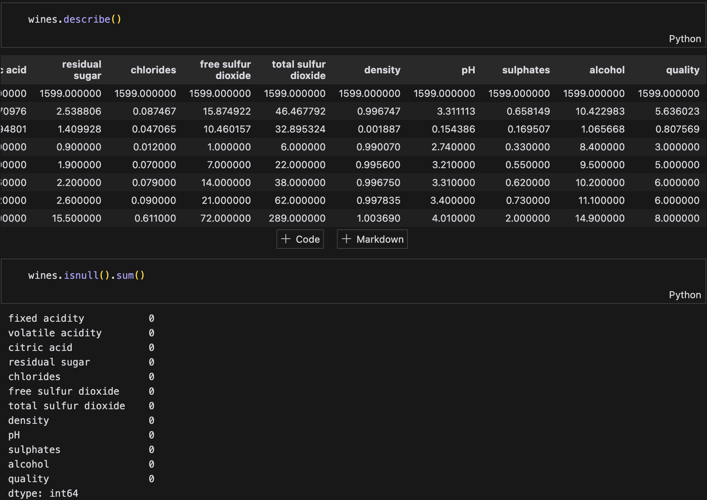
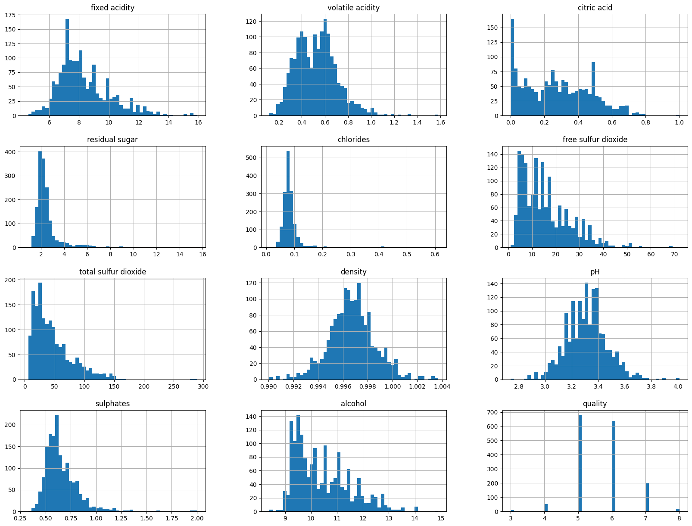

# 🍷 Wine Quality Prediction: End-to-End ML Project

## 📊 Project Overview
Hi there! Let me walk you through this end-to-end Machine Learning project I built. This isn't just another ML model - it's a complete simulation of how Machine Learning Engineers work in the real world. I decided to build a simple wine quality prediction project, because I like wine tasting and I think it's a good way to learn ML! 

The goal of this project is not to build the best wine quality prediction model, but to learn how to build a end-to-end ML project from scratch. I started by setting up a project template, then worked through the entire ML lifecycle: from experimenting in Jupyter notebooks to deploying a containerized application on AWS with CI/CD. 

What makes this project special is that it follows professional MLOps practices, making it similar to how things work in industry.

## 🏗️ Project Architecture
This project follows a MLOps architecture with clear separation of concerns:

**Backend**: Consists of an ML pipeline (data ingestion → validation → transformation → training → evaluation → prediction) and infrastructure components (Docker + AWS). I containerized the application and deployed it on AWS (ECR + EC2) using GitHub Actions for CI/CD.

**Frontend**: Built with Flask and Bootstrap, providing a user-friendly interface where users can input wine characteristics and receive quality predictions. 

**Data Flow**: User inputs → Flask frontend → ML prediction pipeline → Results display, all running within a Docker container on EC2, with model artifacts stored securely in AWS.

## 💻 Tech Stack
I chose these technologies because they represent a modern ML engineering stack:

- **Frontend**: Flask web application
- **Backend**: Python-based ML pipeline
- **Model**: ElasticNet Regression
- **Containerization**: Docker
- **CI/CD**: GitHub Actions
- **Cloud**: AWS (ECR, EC2)

## 🎥 Demo
See the project in action:

Watch the full walkthrough: [Demo Video](https://youtu.be/VIl_RmCabzM)

## 📝 Detailed Project Workflow

### 1. Project Setup

**Project Structure Template Creation**: I started by creating a standardized ML project template. Why? Because having a clear structure from the beginning makes the project more maintainable and scalable. I organized it into components, utils, config, and pipeline directories.

**Virtual Environment Setup**: Next, I isolated the project dependencies using a virtual environment. This is crucial because it prevents conflicts between different projects and makes deployment easier later.

**Logging & Exception Handling**: I implemented comprehensive logging because tracking what's happening in an ML pipeline is essential for debugging and monitoring. The logs include timestamps and module information, making troubleshooting much easier.

### 2. Development Phase

**Define Workflow**: Before diving into coding, I established a clear workflow for updating ML staging files in the correct order:
1. Update config.yaml for configuration settings
2. Update schema.yaml for data validation
3. Update params.yaml for model parameters
4. Update the entity files for data structures
5. Update the configuration manager in src/config
6. Update the components for each pipeline stage
7. Update the main.py to run the pipeline
This structured approach ensures that each component has its required configurations before implementation.
when I am done with the whole data ingestion to model evalution process, I then assemble prediction pipeline in src/wine_quality_prediction_project/pipeline/prediction.py, and write app.py

**Initial Experimentation** (in research/experiment.ipynb):
- **Import Data**: Dataset from [Kaggle](https://www.kaggle.com/datasets/uciml/red-wine-quality-cortez-et-al-2009?resource=download)
- **EDA**: I started with basic EDA to understand the wine quality dataset, checking for null values and examining feature distributions

- **Modeling**: For modeling, I chose ElasticNet Regression specifically because it combines both L1 and L2 regularization, helping prevent overfitting while handling correlated features in wine characteristics
- **Training**: I split the data into training (80%) and testing (20%) sets, trained the model with alpha=0.1 and l1_ratio=0.5
- **Evaluation**: I evaluated the model using RMSE, MAE, and R2 score metrics to get a baseline performance. I choose these metrics because they are commonly used in regression tasks to evaluate the model's performance. The result is RMSE = 0.6986, MAE = 0.5591, R2 = 0.2532, which means the model's predictions are off by about 0.6986 units on average, and the model explains 25.32% of the variance in the target variable.

**ML Pipeline Components**: I broke down the ML pipeline into modular components, following a "experiment first, implement later" approach:
- First, I experimented with each component in Jupyter notebooks (see research/experiment.ipynb) to ensure functionality. I followed the defined workflow above to ensure the code is in the correct order.
- Then, I moved the validated code to corresponding Python files following our defined workflow above
- **Data Ingestion**: Handles data loading and initial storage
- **Data Validation**: Ensures data quality and schema compliance
- **Data Transformation**: Performs feature engineering and preprocessing
- **Model Training**: Implements ElasticNet training with configurable parameters
- **Model Evaluation**: Calculates performance metrics

### 3. Web Application Development
I used Flask to create a simple but effective web interface. The app allows users to input wine characteristics and get quality predictions. I chose Bootstrap for the frontend because it provides clean, responsive design with minimal effort.
The Flask web application with these key files:
- `app.py`: Main application file handling routes, model training, and predictions
- `templates/index.html`: Home page with input form for wine characteristics
- `templates/result.html`: Displays prediction results
- `static/`: Contains CSS and JavaScript files from Bootstrap for styling

### 4. Containerization & Deployment
**Docker Implementation**: I created a `Dockerfile` to containerize the application:
- I used python:3.12.7-slim-buster as the base image for optimal size and compatibility
- Set up the working directory and installed dependencies
- I configured Flask to run optimally in the container environment, ensuring it handles container restarts and scaling gracefully

**CI/CD Pipeline**: Automated the deployment process using GitHub Actions because I wanted to make my lives easier:
1. When I push code changes to GitHub, it kicks off the automation
2. Set up GitHub Actions to automatically build a fresh Docker image
3. The image is pushed to AWS ECR
4. Finally, the application is deployed to EC2

### 5. AWS Setup
I configured AWS services to support deployment:
1. **IAM user**:I created a dedicated IAM user with precisely the permissions needed - following the principle of least privilege for security
2. **ECR repository**: I set up an ECR repository as our secure home for Docker images
3. **EC2 instance**: I configured EC2 instance as a self-hosted runner
4. **GitHub secrets**: I implemented GitHub secrets for AWS access because security is a top priority - no credentials in the code! 

## 🚀 Future Improvements
- **Model Enhancement**: Currently using a single ElasticNet model for simplicity while focusing on the MLOps pipeline. Future versions should implement model comparison (Random Forest, XGBoost, etc.), hyperparameter tuning, and model selection based on cross-validation performance.

- **User Interface Enhancement**: The current UI shows raw numerical predictions without context. Need to add feature descriptions, measurement units, and quality score interpretations (e.g., "5.5 indicates above-average quality") to make predictions more meaningful for users.

- **Monitoring System**: Currently lacks production monitoring. Need to implement model performance tracking, data drift detection, and automated alerts for when model accuracy drops below thresholds.

- **Automated Testing**: The current version lacks comprehensive testing. Should add unit tests for components, integration tests for the pipeline, and automated testing in the CI/CD workflow to ensure reliability.